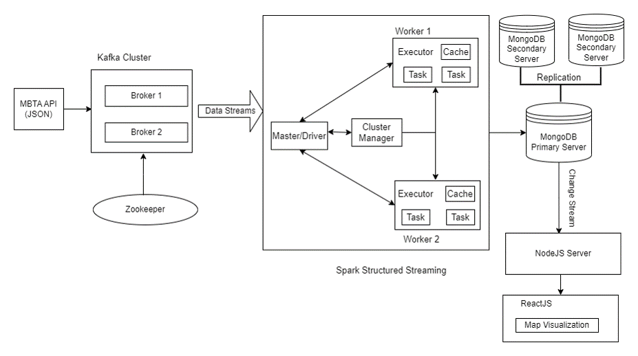
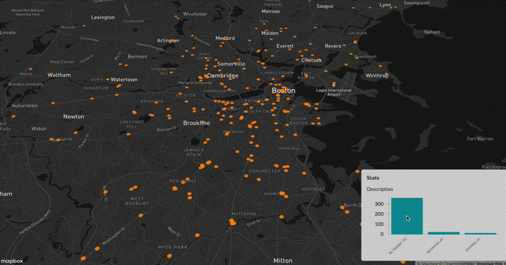

---

# 🚍 Real-Time Geospatial Analytics and Visualization

A distributed **real-time geospatial analytics pipeline** that ingests live public transportation data from the **MBTA (Massachusetts Bay Transportation Authority)** API, processes it using **Apache Kafka and Apache Spark Structured Streaming**, stores it in **MongoDB**, and visualizes vehicle movement on interactive maps in near real time.

---

## 📌 Introduction

Geospatial data refers to information associated with a specific geographic location such as latitude, longitude, city, state, or ZIP code.

This project implements a **distributed streaming ETL architecture** to track and visualize real-time public transit vehicle locations across **Greater Boston, Massachusetts**. Instead of relying on traditional batch analytics or data warehouses, the system performs **continuous, real-time analytics on streaming data**.

---

## 🎯 Objectives & Motivation

* Apply **distributed systems concepts** in a real-world scenario
* Perform **real-time analytics** using streaming data
* Design a **scalable and fault-tolerant** data pipeline
* Analyze vehicle movement and traffic patterns in public transportation networks
* Combine **GIS, Big Data, and Web Visualization** into a single system

---

## 🏗️ System Architecture

### End-to-End Distributed Streaming Architecture

The following diagram illustrates the complete data flow and system components used in this project:

* **MBTA API** provides live vehicle location data in JSON format
* **Apache Kafka** ingests and distributes real-time data streams
* **Apache Spark Structured Streaming** processes data in parallel across worker nodes
* **MongoDB** stores processed data with replication for high availability
* **MongoDB Change Streams** push updates to the backend in real time
* **Node.js** serves live data to the frontend
* **React.js + Mapbox** visualize vehicle movement on an interactive map

---

## 🔄 System Workflow

1. **Data Ingestion**
   * API Documentation: https://api-v3.mbta.com/docs/swagger/index.html
   * Live vehicle data extracted from the MBTA API
   * Data published to Kafka topics by producers

2. **Streaming & Distributed Processing**

   * Spark Structured Streaming consumes Kafka topics
   * Micro-batch processing using Spark SQL DataFrames
   * Tasks executed in parallel by executors across worker nodes

3. **Data Storage**

   * Processed geospatial data stored in MongoDB collections
   * Replication ensures reliability and fault tolerance

4. **Real-Time Analytics & Visualization**

   * MongoDB Change Streams notify backend of updates
   * Node.js pushes updates to frontend
   * React.js renders live map and statistics

---

## 📥 Data Ingestion

### MBTA API

* Provides real-time vehicle locations for Boston-area public transit
* Supports heavy rail, light rail, and bus services

### Apache Kafka

Kafka acts as a **fault-tolerant, high-throughput event streaming platform**.

**Core Components:**

* **Producers:** Publish vehicle location events
* **Brokers:** Manage message storage and distribution
* **Topics:** Logical channels for streaming data
* **Consumers:** Read messages from topics
* **Zookeeper:** Handles coordination, leader election, and metadata management

---

## ⚙️ Distributed Data Processing

### Apache Spark Structured Streaming

* Built on Spark SQL
* Uses **micro-batch execution model**
* Supports scalable and fault-tolerant stream processing
* Operates on structured DataFrames

### Spark Cluster Components

* **Driver / Master:** Coordinates job execution
* **Executors:** Run tasks in parallel on worker nodes
* **Cache:** Stores intermediate data for performance optimization

---

## 🗄️ Data Storage

### MongoDB

* Stores real-time processed geospatial data
* Supports **replica sets** for high availability
* Optimized for fast read access by visualization layer

---

## 🗺️ Real-Time Map Visualization

The image below shows the **live geospatial visualization** of MBTA vehicles across **Greater Boston**.

### Key Features

* Each point represents a real-time vehicle location
* Continuous updates without page refresh
* Interactive map powered by **Mapbox**
* Live statistics panel showing vehicle states such as:

  * *In Transit*
  * *Stopped*
  * *Incoming*

This visualization enables real-time monitoring of public transportation movement and traffic conditions.

---

## 🚀 Future Enhancements

* Track **emergency vehicles** (ambulances, fire trucks) for route optimization
* Extend analytics to include:

  * Vehicle speed
  * Vehicle type
  * Vehicle identification
* Provide alerts for:

  * Vehicle occupancy
  * Wheelchair accessibility
  * Expected arrival times
  * Service disruptions
* Scale the system to support public transportation data from other cities worldwide

---

## 🧰 Technology Stack

* **API:** MBTA API
* **Streaming Platform:** Apache Kafka
* **Processing Engine:** Apache Spark Structured Streaming
* **Database:** MongoDB
* **Backend:** Node.js
* **Frontend:** React.js
* **Mapping:** Mapbox
* **Architecture:** Distributed, scalable, fault-tolerant

---

## 💡 Why This Project Is Important

* Demonstrates **real-time streaming analytics**
* Applies **distributed computing concepts** in practice
* Integrates **GIS + Big Data + Web Engineering**
* Highly relevant for roles such as:

  * GIS Analyst / GIS Engineer
  * Data Engineer
  * Big Data / Streaming Analytics Engineer

---
